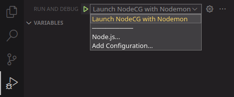
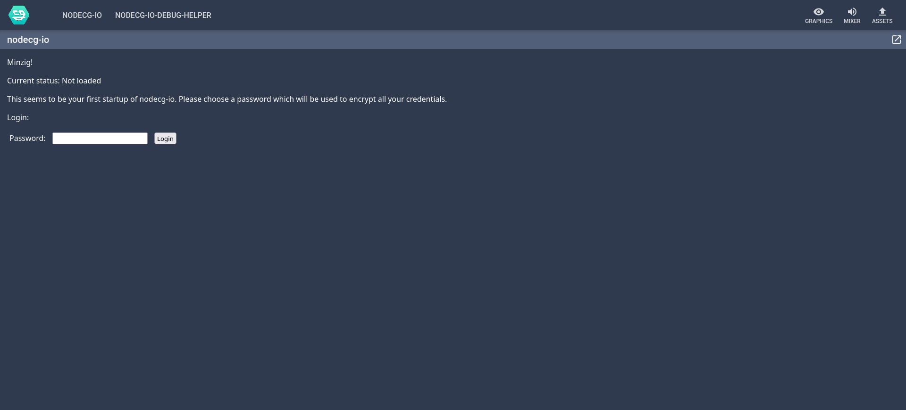

# Try an included sample

Trying one of the premade example bundles is a good way to get to know the
framework and especially the selected service.

!!! ATTENTION

    In case you installed the **production** branch of nodecg-io, you are out of
    luck. Because the build process will cause problems if you just take one of the
    samples and rebuild elsewhere.

If you installed **dev** branch via the `nodecg-io-cli` and did not select the
“use the samples”-option run `nodecg-io install` and select it.

In case you cloned the repository directly from GitHub, everything should be
included. But you may want to pull recent changes and rebuild the project.

## Step 1: Run NodeCG

Now you need to start NodeCG. There are a couple of different ways to do this:

### Using VS Code

If you have nodecg-io open in your VS Code instance, you can launch NodeCG using
the `Run and Debug` Explorer View:

### Using the terminal

You may also launch NodeCG using your terminal with:

<pre><code><b>user@computer:<spanstyle="color:#3daee9">~/nodecg</b>$ npm run start

> nodecg@1.8.1 start
> node index.js

info: [nodecg/lib/server] Starting NodeCG 1.8.1 (Running on Node.js v16.11.1)
info: [nodecg-io-core] Minzig!

// A whole host of logging output

info: [nodecg/lib/server] NodeCG running on http://localhost:9090</code></pre>

Now you can open the NodeCG dashboard (by default) under
<http://localhost:9090>.

## Step 2: Log in to nodecg-io

Now navigate to the `nodecg-io` tab in the NodeCG dashboard.

If you are logging in for the first time you will have to set your password.

Else you simply have to log in with your previously chosen password.

Now you are looking at the `nodecg-io` config menu. It should look like this:

## Step 3: Learning how to use the GUI

The current GUI is just intended to make the project usable, but it is not very
user-friendly. As a more long term solution, a new GUI will be developed that
also focuses on user experience. Until the new GUI is developed, you will have
to arrange yourself with this one. So, to get started:

### In pink: NodeCG Tabs

Here you will find every NodeCG-bundle that has a dashboard. Here you may select
the [nodecg-io-debug](../samples/debug.md)-dashboard, if it is installed.

### In yellow: Monaco editor

It is basically only a text editor which is used to save configurations for
service instances.

### In green: Services section

Here you may create, update and delete instances of a service. Each instance has
its own name and configuration. The menu will expand depending on the option
selected in the first dropdown.

_Creating a new service instance_:

This can be accomplished by selecting the item `'New'`. Then a new dropdown will
be revealed, in witch you may select the service type. Additionally, you must
select an instance name. Then click `'Create'`. The newly created instance
should be selected.

_Configure a service instance_:

While a supported service instance is selected, you may change the config in
monaco, then click `'Save'`.

_Deleting a service instance_:

This can be accomplished by selecting an existing instance. Then click
`'Delete Instance'`.

### In violet: Bundles section

This section has three dropdowns:

1. Bundle: Here you can select a bundle to configure.
2. Service: If this bundle uses more than one service, you may select the
   service to set or unset here.
3. Service Instance: Here you can select one instance of the service type set at
   2 or `none`.

### In red: Unset all Button

This button will set the service instance for every bundle/service combination
to none, effectively removing the access to every service from all bundles.

!!! DANGER

    This can not be undone, and you will have to set up all the bundles
    again. __The service instances will be unaffected.__

## Step 4: Configure the sample

The configurations for every sample bundle differ too greatly from each other to
be included here, so you have to take a look at the documentation for your
sample bundle. You will find it on the left-hand side of this page in the
category `Services`.
